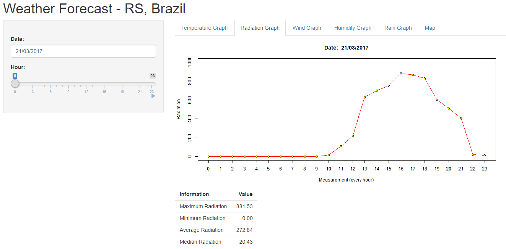
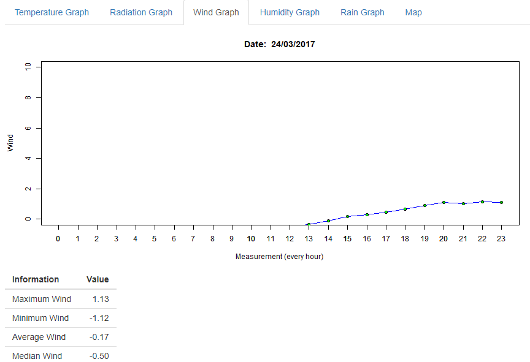
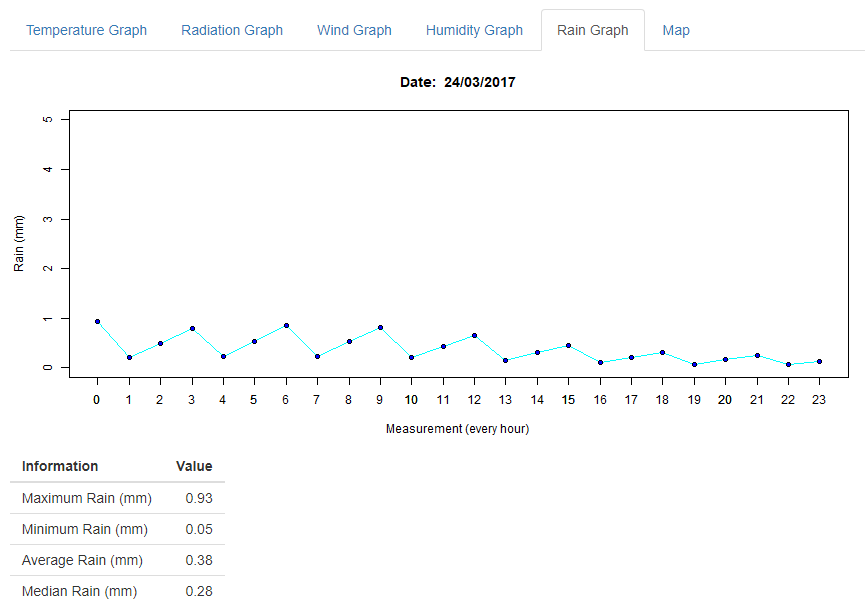
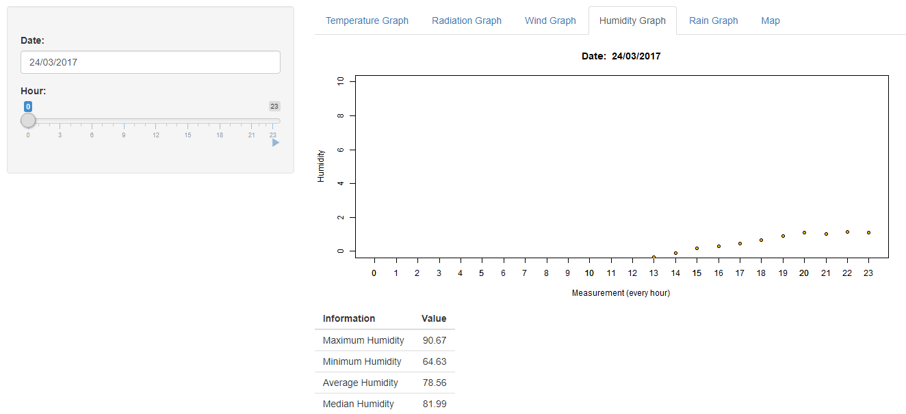

# Weather_Graphs
This code plots temperature, radiation, wind, rain and humidity graphs using R:

It also plots a map:

*Observation:* you can set the **longitude** and **latitude** of any place. This particular map is from Rio Grande do Sul, Brazil.

## Getting started

- Install R[https://cran.r-project.org];
- Install RStudio[https://rstudio.com/products/rstudio/download/];
- Open the file "server.R" or "ui.R";
- Clink in "Run App" in RStudio. RStudio will download all necessary libraries and will open a UI.

*Observation:* you can load other files (with the same structure) of different dates. These particulars .Rda files are from March 21th to 24th of 2017.

#### This was an assignment for Scientific Computing class by Ph.D Carlos Holbig from University of Passo Fundo in 2017-1.
