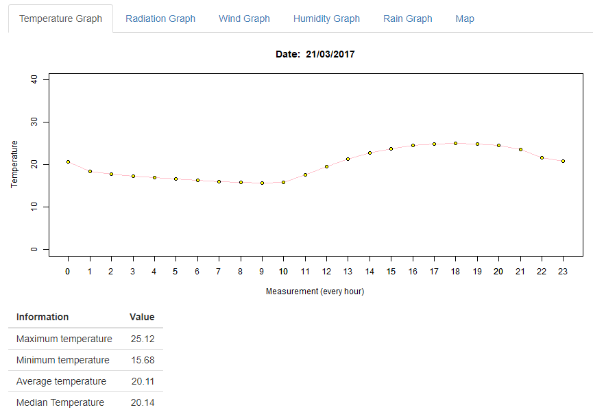
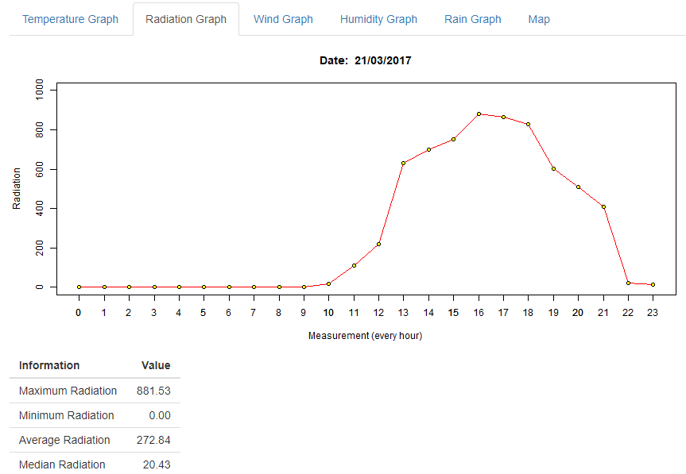
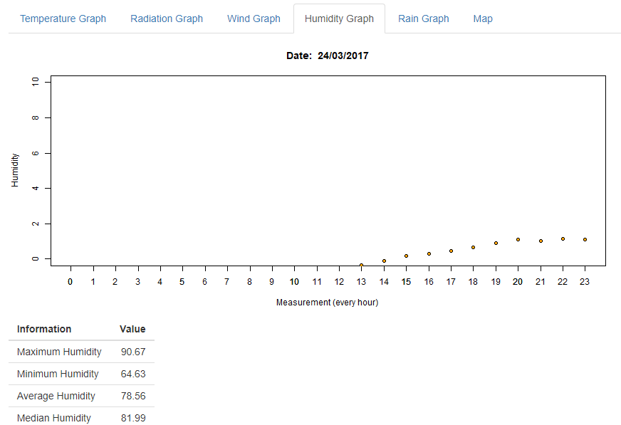
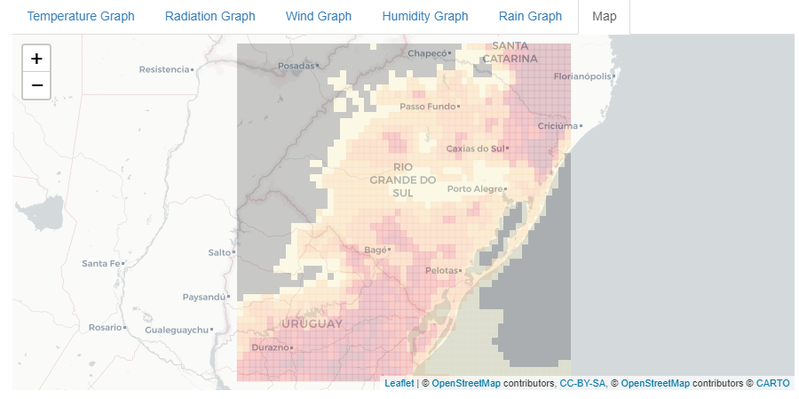

# Weather_Graphs
This code plots temperature, radiation, wind, rain and humidity graphs using R and a map.

## Getting started

- Install [R](https://cran.r-project.org);
- Install [RStudio](https://rstudio.com/products/rstudio/download/);
- Open the file [server.R](server.R) or [ui.R](ui.R) using RStudio;
- Clink in "Run App" in RStudio. RStudio will download all necessary libraries and will open a UI.

*Observation:* you can load other files (with the same structure) of different dates. These particulars .Rda files are from March 21th to 24th of 2017.

## Graphs

### Temperature:

### Radiation:

### Wind:

### Humidity:

### Rain:

### Map:

*Observation:* you can set the **longitude** and **latitude** of any place. This particular map is from Rio Grande do Sul, Brazil.

#### This was an assignment for Scientific Computing class by Ph.D Carlos Holbig from University of Passo Fundo in 2017-1.
